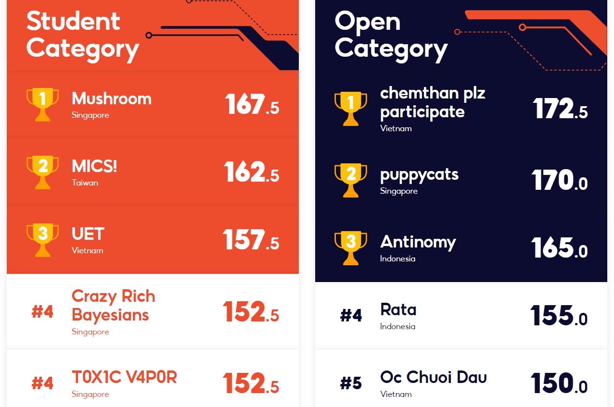
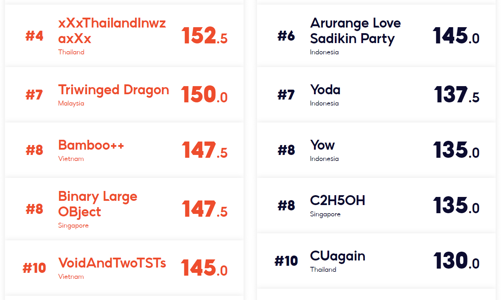
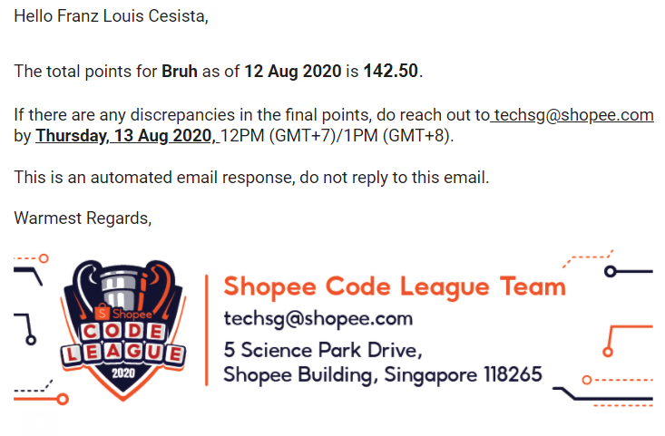

# Team Bruh's Solutions to the Shopee CodeLeague 2020

Our team finished 11th out of hundreds of teams from all around the world.

Note: we removed the datasets and some codes in _Title Translation_ and _Sentiment Analysis_ as they are too big to be included in the repository.

## Rounds

| Round | Brief Round Description |
| --- | --- |
| [Order Brushing](/1-order-brushing/) | Detect vendors who try to cheat the recommender algorithm with suspicious transactions. |
| [Product Detection](/2-product-detection/) | Given an image, detect and classify the object in the image to one of Shopee's 30+ product classes. |
| [Short Contest #1](/3-short-contest-1/) | Data structures and algorithms contest on HackerEarth. |
| [Title Translation](/4-title-translation/) | Given a title, translate it to a different language. |
| [Logistics](/5-logistics/) | Calculate the number of late deliveries, the deadlines of which depends on the origin and the destination. |
| [Sentiment Analysis](/6-sentiment-analysis/) | Given a review of a product, predict the sentiment of the review. |
| [Short Contest #2](/7-short-contest-2/) | Data structures and algorithms contest on HackerEarth. |
| [Marketing Analytics](/8-marketing-analytics/) | Given user log data, determine whether that user will click Shopee's marketing email or not. |

## The Team

- [Cesista, Franz Louis](https://github.com/leloykun)
- Macarasig, Ralph Joshua
- Montemayor, Raphael Jose
